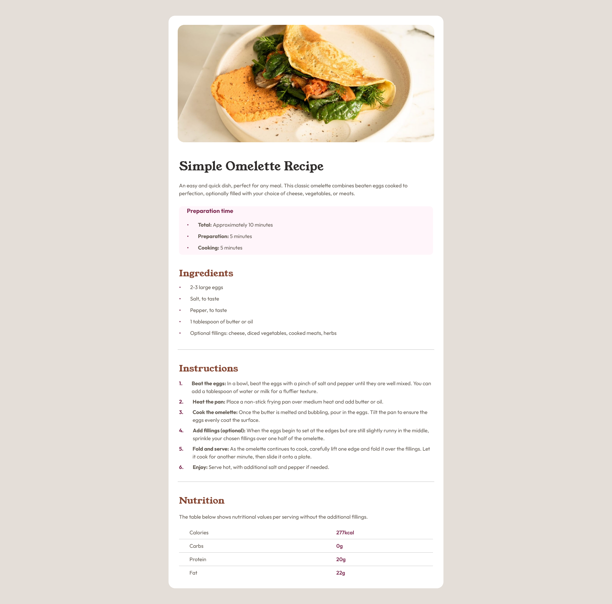
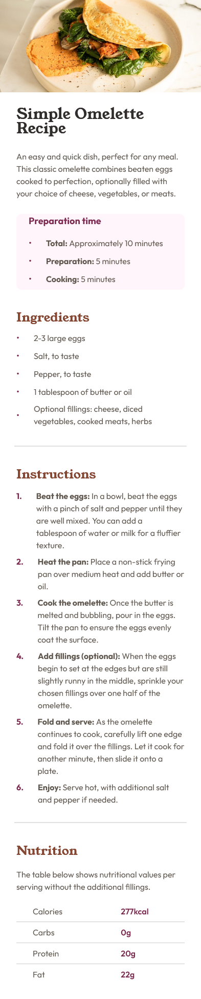

# Frontend Mentor - Recipe page solution

This is a solution to the [Recipe page challenge on Frontend Mentor](https://www.frontendmentor.io/challenges/recipe-page-KiTsR8QQKm). Frontend Mentor challenges help you improve your coding skills by building realistic projects. 

## Table of contents

- [Overview](#overview)
  - [The challenge](#the-challenge)
  - [Screenshot](#screenshot)
  - [Links](#links)
- [My process](#my-process)
  - [Built with](#built-with)
  - [What I learned](#what-i-learned)
  - [Continued development](#continued-development)
  - [AI Collaboration](#ai-collaboration)
- [Author](#author)
- [Acknowledgments](#acknowledgments)

## Overview

### Screenshot

### Links

- Solution URL: [Solution in Frontend Mentor]()
- Live Site URL: [Live site in Github pages](https://pauvera.github.io/recipe-page-main/)

## My process

### Built with

- Semantic HTML5 markup
- CSS custom properties
- CSS cascade layers
- Mobile-first workflow
- Flexbox
- Fluid typography using clamp()
- CUBE CSS-inspired architecture
- BEM naming conventions
- Modern CSS nesting

### What I learned

This project helped me better understand the difference between primitive and semantic design tokens.

At first, I tried to design the entire token system before building the interface, but that quickly became overwhelming. Refactoring after the layout existed made the architecture much clearer and more intentional.

I also practiced:
- Creating a scalable spacing system
- Structuring CSS with cascade layers
- Using semantic HTML elements like tables, lists, and section headings appropriately
- Building fluid typography directly from primitive font-size tokens
- Thinking critically about when abstraction adds real value versus unnecessary complexity

One of the most valuable lessons from this project was learning to let patterns emerge naturally during implementation instead of forcing abstractions too early.

### Continued development

In future projects, I want to continue improving:
- Design token architecture
- Semantic naming strategies
- CSS composition patterns
- Accessibility
- Visual rhythm and spacing systems
- Responsive typography systems

### AI Collaboration

ChatGPT was used during this project as a learning and architectural assistant.

The collaboration focused on:
- Reviewing CSS architecture decisions
- Refining semantic and primitive token structure
- Improving naming consistency
- Evaluating spacing and typography systems
- Discussing accessibility implications of custom list markers
- Reviewing BEM and CUBE CSS usage
- Identifying opportunities for meaningful refactoring
- Translating documentation to english

A major takeaway from the collaboration process was learning to avoid premature abstraction and instead allow systems to emerge naturally from real UI patterns.

The AI was intentionally used as a reasoning partner rather than a code generator.

## Author

- Website - [Pau's Github](https://github.com/PauVera)
- Frontend Mentor - [@PauVera](https://www.frontendmentor.io/profile/PauVera)